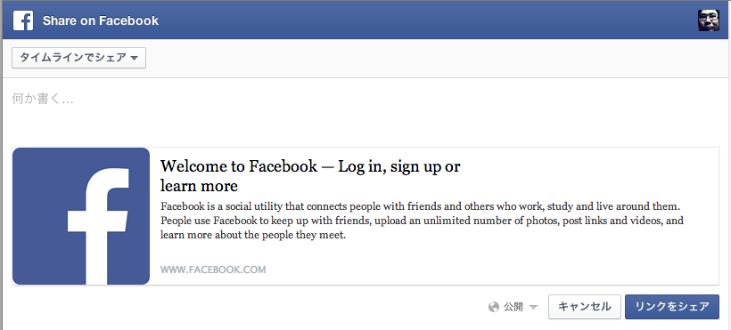
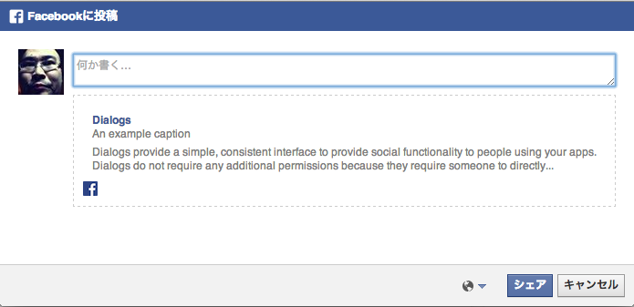

facebook
======

## APIによるフィードへの投稿でプリセットの規約違反について

> https://developers.facebook.com/policy/

> IV. Application Integration Points

> You must not incentivize users to use (or gate content behind the use of) Facebook social channels, or imply that an incentive is directly tied to the use of our channels.
> __You must not pre-fill__ any of the fields associated with the following products, __unless the user manually generated__ the content earlier in the workflow: Stream stories ()__user_message__ parameter for Facebook.streamPublish and FB.Connect.streamPublish, and _message_ parameter for stream.publish), __Photos (caption)__, __Videos (description)__, Notes (title and content), __Links (comment)__ , and Jabber/XMPP.

「Facebookアプリ（APIを利用）では、ポストの本文や、写真のキャプションなどのテキストを一切プリセットしてはいけない。ユーザーが手で入力した場合のみ、ゆるされる」

（__技術的には__可能である）

逆にいえば、それ以外のフィールドはプリセットしてもよい。

[いわゆるポストのAPI仕様](https://developers.facebook.com/docs/graph-api/reference/post/)
[写真投稿のAPI仕様](https://developers.facebook.com/docs/graph-api/reference/photo)


# OAuthを使わないFacebookのリンクシェアポストについて

### Sharerを使った方法

どうやら基本的には今後非推奨の模様

```
https://www.facebook.com/sharer/sharer.php?u=https%3A%2F%2Fwww.facebook.com
```

画像やCaptionは取得先のOGPが使われる



### dialog/feedを使った方法

[API仕様](https://developers.facebook.com/docs/sharing/reference/feed-dialog)

```
https://www.facebook.com/dialog/feed?app_id=145634995501895&display=popup&caption=An%20example%20caption&link=https%3A%2F%2Fdevelopers.facebook.com%2Fdocs%2Fdialogs%2F&redirect_uri=https://developers.facebook.com/tools/explorer
```

様々なパラメタが渡せるので、こちらを使うべきだろう。
AppIDが必要である。

サンプル画像


## Likeボタン作成

[こちらから](https://developers.facebook.com/docs/plugins/like-button)


## 友達のタイムラインには投稿はできません

[https://developers.facebook.com/blog/post/2012/10/10/growing-quality-apps-with-open-graph/](https://developers.facebook.com/blog/post/2012/10/10/growing-quality-apps-with-open-graph/)

> Post to friends wall via the API generate a high levels of negative user feedback, including “Hides” and “Mark as Spam" and so we are removing it from the API. 


## 友達をタグ付け(Mention tagging)

[https://developers.facebook.com/docs/opengraph/using-actions/v2.1](https://developers.facebook.com/docs/opengraph/using-actions/v2.1)

Mention Taggingは別途の審査などが必要になります。

> The first step is to enable the tagging capability for your action type. This requires an additional approval process before it can be used by anyone who's not a developer or tester of your app.

