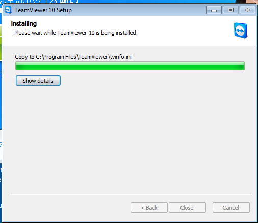

# TeamViewerによるリモート操作を受ける手順について

TeamViewerを使う事で、リモートからあなたのパソコンを操作することができます。以下に「操作をされる」時の手順を記載致します。

以下スクリーンショットは英語ですが、的旨置き換えて読んでください。

## TeamViewerをダウンロード

[https://www.teamviewer.com/ja/](https://www.teamviewer.com/ja/)

ダウンロードボタンを押すと、各種ブラウザによって異なりますが「開く（実行する）」、「保存する」などが選択できます。

ここでは実行する（Run）を押します（保存して、実行してもかまいません）

環境によっては、以下のような表示になりますが、待っていて下さい。

## インストーラーの設定

TeamViewerは商用利用にはライセンスが必要です。

商用利用でない場合には、無料です、以下のように選択してください。

UACのダイアログは、許可をしてください（はい、またはYes）

その後、インストールが進行します。

## 完了後起動

インストール直後は自動的に起動します。最初の説明のダイアログはCloseなどを押して閉じてください。

もし自動的に起動しない場合には、デスクトップのアイコンをダブルクリックして起動してください。

## リモート操作の依頼（一度インストールしたらここから）

起動したTeamViewerの画面にはYourIDとPasswordが表示されます、以下の「558〜xxx」と、「xxx2」の箇所で。これを操作する人に伝えて下さい。

このIDとパスワードは基本的に安全に受け渡しをする必要がありますが、TeamViewerを起動しっぱなしにしたりせず、操作をPCの前で見張っているかぎりはメールやチャットなどで受け渡してもかまわないでしょう。

勿論、可能であれば安全な二つの経路で（IDをメール、パスワードを電話など）つたえるべきです。

また、このパスワードは固定ではありません、起動する度に変わりますので都度伝える必要があります。

## 強制切断

リモート操作中、右下にTeamViewerのドロワー（ウインドウ）が表示されます。こちらをひらき、×の閉じるボタンを押す事で接続を解除できます。

場合によっては、収納されていますので、タブをクリックして広げます。

なんらかの理由で強制切断した場合は、再接続させないようにTeamViewerを終了しましょう。

## 終了

終了時にダイアログが出た場合はOKなどを押して閉じます。

リモート操作がおわったら、タスクバーに残っているTeamViewerを右クリックし、Close Windowするなどで終了できます。

さらに広告のダイアログが出る事がありますが、そちらもとじてかまいません。

## アンインストール

必須ではありませんが、コントロールパネルの「ソフトウェアの削除と変更」から可能です。

