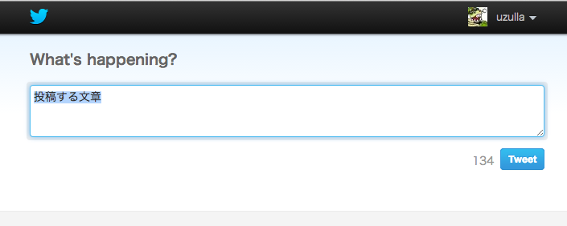
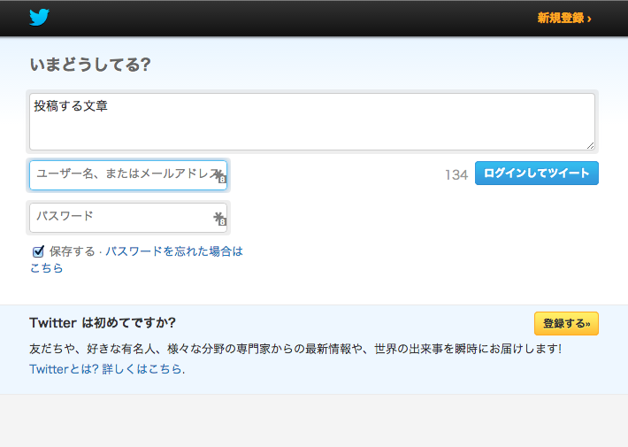

Twitter
======

## Twitterアプリに関して

[アプリ新規作成、APIキーの取得などはこちら](token.md)

## intent OAuthなしでのTwitterへの投稿

```
http://twitter.com/intent/tweet?text=投稿する文章
```

このようなURLをひらくことでツイッターに投稿をするフォームが作れる。
URLを開くだけなので、OAuthは不要。
JSやリンクなどで開く。

以下のような画面になる


ログインしていない場合は、以下のようになる


戻る事はできないので、ポップアップなどで開く必要がある。


