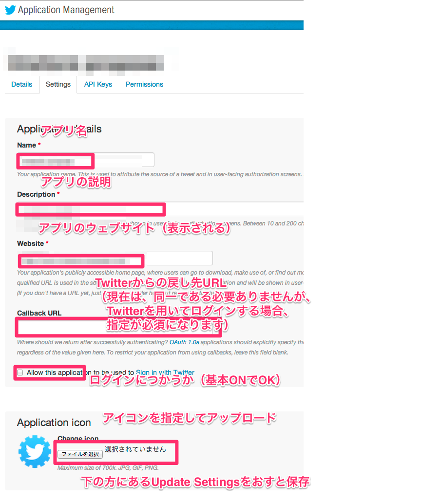

# twitterのアプリ関連

## アプリの管理画面へのログイン
[https://apps.twitter.com/](https://apps.twitter.com/) をひらき、そのトークン所有者となるアカウントでログインする（そのアカウントはログイン時に見えるので、個人アカウントではまずい）

## アプリの新規作成
ログイン後、「Create New App」ボタンを押し、必要項目を入力する

最後にCreate yout twitter applicationを押す

## 既存アプリの選択

ログインするとアプリが一覧表示されるので、確認・編集したいアプリを選ぶ

## アプリ確認画面トップ

- 認証時に表示される文言やアイコンを変更するには > settings
- APIキーを確認したい場合は > API keys

のタブをひらく

## settings アプリ情報編集画面

アプリ認証時などに表示されるアイコンや、アプリ名などを変更できる。
最後にかならず保存を押すこと。

アイコンは保存に失敗することが希にあるので、反映されなければリロード、または何度か保存する。

この画面自体が不安定なことがよくあるので、保存ボタンをおしてしばらくしても変化がないようであれば、リロードして、再度設定をやりなおすこと

callback URLはTwitterでログインさせる場合には必須なので、サイトのドメインなどを入力しておく。本当のcallback先とURLがことなっても（現在の所は）動作します。

## アプリAPIキー（トークン）確認画面

APIアクセス時に必要になるAPI Key、API Secret Keyはここから取得できる。

- Keyは絶対に公開してはいけない
- Gitなどのバージョン管理システムにもいれてはいけない
- 「基本的に」メールなども避けるべき

## アプリ権限編集画面

対応するAPIキーで可能な操作を変更する。

- Twitter経由でログインさせたいだけ
- intentによって投稿する
- ユーザーの名前やアカウント名をしらべる

場合はRead Onlyでよい。

API経由での投稿が必要な場合のみ、Read and Writeに設定する。

